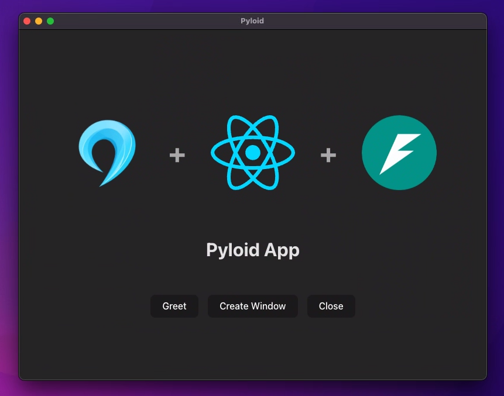

<h1 style="text-align: center; font-size: 200px; font-weight: 500;">
    <i>Pyloid</i>
</h1>



<h2 align="center" style="font-size: 28px;"><b>Pyloid: Thread-Safe Desktop Apps—Unified with Any Frontend and Python Technology</b></h2>


## 💡 Key Features 

- **All Frontend Frameworks** are supported
- **All features necessary** for a desktop application are implemented
- Through thread-safe implementation, it seamlessly **integrates with any Python framework**
- **RPC** between Python and JavaScript
- Single Instance Application / Multi Instance Application Support
- Multi-Window Application Support
- Clean and Intuitive Code Structure
- **Cross-Platform Support**
- Window Customization
- **Detailed Numpy-style Docstrings**


## 🚀 Getting Started

### [Prerequisites](https://docs.pyloid.com/getting-started/prerequisites)

- Node.js
- Python
- uv

### [Create Project](https://docs.pyloid.com/getting-started/create-pyloid-app)

```bash
npm create pyloid-app@latest
```

## Documentation 📚

[Pyloid Documentation](https://docs.pyloid.com/)

## License

This project is licensed under the terms of the Apache License 2.0. See the [LICENSE](./LICENSE) file for details.

This project uses PySide6, which is licensed under the LGPL (Lesser General Public License).

## Contributing 🤝

⚙

## Issues

If you encounter any issues or have suggestions for improvements, please open an issue on the [GitHub repository](https://github.com/Pyloid/pyloid/issues).
